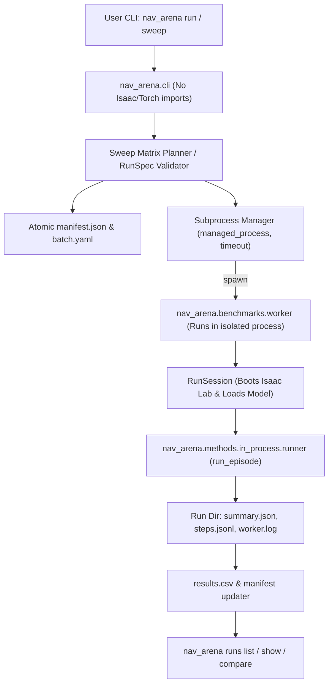

# Implementation Plan: Unified `nav_arena` Entry Point, Batch Sweeps, and Run Tracking

This plan outlines the architecture, component decomposition, and subagent task breakdown for implementing the unified entry point designed in [`nav_arena/docs/design/unified-entry-point.md`](file:///home/robopi/simulation/nav_arena/docs/design/unified-entry-point.md).

---

## Progress Checklist

- [x] **Task 0 (Phase 0)**: Lazy Dingo Asset Resolution & Unit Tests
- [x] **Task 1 (Phase 1A)**: `RunSpec`, Validation & Override Logic
- [x] **Task 2 (Phase 1B)**: `RunSession`, Worker Subprocess & `verify_baseline.py` Shim
- [x] **Task 3 (Phase 1C)**: CLI Subcommand `nav_arena run` & Results Row
- [x] **Task 4 (Phase 2A)**: Manifest State Machine & Batch Directory
- [x] **Task 5 (Phase 2B)**: Sweep Matrix Planner & `nav_arena sweep`
- [x] **Task 6 (Phase 3)**: Run Tracking & Query Subcommands (`nav_arena runs`)
- [x] **Task 7 (Phase 4)**: Tool Subcommands (`doctor`, `routes`, `map`)
- [x] **Task 8**: End-to-End System Audit & Headless Simulation Run

---

## 1. Goal Description

Currently, evaluating navigation baselines requires executing `nav_arena/nav_arena/scripts/verify_baseline.py` directly, which mixes CLI parsing, Isaac Sim startup, environment construction, policy evaluation, and result printing. Batch runs, matrix sweeps across robots/methods/routes/seeds, and structured metric tracking are done manually.

This project delivers:
1. **Lazy Dingo asset resolution (Phase 0)**: Eliminates top-level asset building at import time so that importing `nav_arena.embodiments` never fails or blocks CLI execution.
2. **Unified library & single-run entry point (Phase 1)**: Decouples `RunSession` and `EpisodeSpec` under `nav_arena.benchmarks`, provides `worker.py` for isolated execution, introduces `nav_arena run`, and refactors `verify_baseline.py` into a thin shim.
3. **Batch sweeps & manifest state machine (Phase 2)**: Introduces `nav_arena sweep` with matrix expansion (`robots x methods x routes x seeds`), atomic `manifest.json` state updates, pre-flight Isaac check, process-group timeout via `managed_process`, and `--resume` capabilities.
4. **Run tracking & reporting (Phase 3)**: Adds `nav_arena runs list`, `show`, `compare`, and `rerun` reading `manifest.json` and `results.csv`.
5. **Tool subcommands (Phase 4)**: Adds `nav_arena doctor`, `routes`, and `map` subcommands.

---

## 2. User Review Required

> [!IMPORTANT]
> **No Backwards Compatibility Required**: Per user confirmation, existing global variables like `DINGO_CFG` will not use fallback deprecation wrappers or `__getattr__` shims. Clean, explicit factory functions (`create_dingo_articulation_cfg()`) will replace them directly.
>
> **Fast CLI Startup Guarantee**: The CLI process (`nav_arena`) must NEVER import `isaaclab`, `isaacsim`, `omni`, or `pxr`. All simulation, PyTorch model loading, and rendering occur strictly inside worker subprocesses launched via `managed_process`.

---

## 3. Architecture & Data Flow



---

## 4. Proposed Changes & Subagent Task Breakdown (/boost)

To execute effectively under `/boost`, the work is partitioned into discrete, self-contained subagent tasks with strict boundary contracts and automated verification gates.

```
nav_arena/
├── nav_arena/
│   ├── benchmarks/               # [NEW] Worker library, specs, and orchestration
│   │   ├── __init__.py
│   │   ├── spec.py               # RunSpec, validation, overrides
│   │   ├── session.py            # RunSession (Isaac boot, task, viewer, policy)
│   │   ├── worker.py             # Subprocess worker entry point
│   │   ├── manifest.py           # Atomic manifest.json manager & state machine
│   │   ├── sweep.py              # Matrix expansion, sweep runner, resume logic
│   │   ├── tracking.py           # Query & compare logic for runs/batches
│   │   └── doctor.py             # Health and environment inspector
│   ├── cli.py                    # [NEW] Main CLI entry point
│   ├── embodiments/
│   │   ├── __init__.py           # [MODIFY] Export create_dingo_articulation_cfg
│   │   └── dingo.py              # [MODIFY] Lazy asset resolution factory
│   └── scripts/
│       └── verify_baseline.py    # [MODIFY] Thin shim over RunSession / worker
├── sweeps/                       # [NEW] Default sweep configurations
│   └── baselines_kujiale_0003.yaml
├── tests/unit/                   # [NEW & MODIFY] Pure CPU unit tests
│   ├── test_embodiment_assets.py # [MODIFY] Test lazy build isolation
│   ├── test_benchmark_spec.py    # [NEW] Spec validation & override tests
│   ├── test_manifest.py          # [NEW] Manifest atomic writes & transitions
│   ├── test_sweep.py             # [NEW] Matrix expansion & resume tests
│   └── test_tracking.py          # [NEW] Result aggregation & compare tests
└── pyproject.toml                # [MODIFY] Add [project.scripts] nav_arena
```

---

### Task 0: Lazy Dingo Asset Resolution (Phase 0)
* **Assigned Role**: DeepCoder
* **Scope**:
  - In [`nav_arena/nav_arena/embodiments/dingo.py`](file:///home/robopi/simulation/nav_arena/nav_arena/embodiments/dingo.py):
    - Replace eager `_resolve_dingo_usd()` and top-level `DINGO_CFG` with `create_dingo_articulation_cfg() -> ArticulationCfg`.
    - Set `DingoEmbodimentCfg.articulation_cfg: ArticulationCfg = field(default_factory=create_dingo_articulation_cfg)`.
  - In [`nav_arena/nav_arena/embodiments/__init__.py`](file:///home/robopi/simulation/nav_arena/nav_arena/embodiments/__init__.py):
    - Export `create_dingo_articulation_cfg` instead of `DINGO_CFG`.
  - In [`nav_arena/tests/unit/test_embodiment_registry.py`](file:///home/robopi/simulation/nav_arena/tests/unit/test_embodiment_registry.py):
    - Remove unused `DINGO_CFG` import.
  - In [`nav_arena/tests/unit/test_embodiment_assets.py`](file:///home/robopi/simulation/nav_arena/tests/unit/test_embodiment_assets.py):
    - Add test confirming `import nav_arena.embodiments` and `get_embodiment("nova_carter")` succeed even if `ensure_derived_asset` raises an error.
    - Confirm `get_embodiment("dingo")` instantiates and resolves properly.
* **Verification Gate**:
  - Run `./agy_python.sh -m pytest -c nav_arena/pyproject.toml nav_arena/tests/unit/test_embodiment_assets.py nav_arena/tests/unit/test_embodiment_registry.py -q`.

---

### Task 1: `RunSpec`, Validation & Override Logic (Phase 1A)
* **Assigned Role**: DeepCoder
* **Scope**:
  - Create [`nav_arena/nav_arena/benchmarks/spec.py`](file:///home/robopi/simulation/nav_arena/nav_arena/benchmarks/spec.py):
    - `VizCfg`: `gui: bool = False`, `follow_camera: bool = False`, `goal_overlay: bool = True`.
    - `EpisodeLimits`: `max_steps: int = 1500`, `goal_tolerance: float = 0.4`, `max_speed: float = 0.3`, `stall_timeout_s: float = 10.0`.
    - `RunSpec`: `method: str`, `method_family: str`, `robot: str`, `scene: str`, `route: str | None`, `spawn: tuple[float, float] | None`, `goal: tuple[float, float] | None`, `spawn_yaw: float | None`, `seed: int`, `method_params: dict[str, Any]`, `limits: EpisodeLimits`, `viz: VizCfg`, `output_dir: Path | None`.
    - Serialization/deserialization: `to_dict()`, `from_dict()`, `to_json()`, `from_json()`.
    - Spec hash generation (`spec_hash`).
    - Pure validation logic extending `validate_route_args` (ensures `method` in allowed baselines or reserved `nav2`, valid route/spawn/goal configuration).
    - `apply_overrides(spec: RunSpec, overrides: dict[str, Any], logger) -> RunSpec` with logged INFO/WARNING lines.
  - Create [`nav_arena/tests/unit/test_benchmark_spec.py`](file:///home/robopi/simulation/nav_arena/tests/unit/test_benchmark_spec.py):
    - Unit tests for validation, serialization roundtrips, override warnings, and error cases (pure CPU, runs in <0.2s).
* **Verification Gate**:
  - Run `./agy_python.sh -m pytest -c nav_arena/pyproject.toml nav_arena/tests/unit/test_benchmark_spec.py -q`.

---

### Task 2: `RunSession`, Worker Subprocess & `verify_baseline.py` Shim (Phase 1B)
* **Assigned Role**: DeepCoder
* **Scope**:
  - Create [`nav_arena/nav_arena/benchmarks/session.py`](file:///home/robopi/simulation/nav_arena/nav_arena/benchmarks/session.py):
    - `SessionKey`: dataclass of invariant parameters (`scene`, `robot`, `method`, `method_params_hash`, `viz`).
    - `RunSession`: encapsulating `launch_simulation_app`, `create_point_nav_env_cfg`, `PointNavTask`, viewer/overlay setup, and policy loading.
    - `session.run_episode(EpisodeSpec) -> EpisodeResult`: calls existing `run_episode` from `methods/in_process/runner.py`.
    - Checks for reserved `method == "nav2"`, raising a clean `NotImplementedError("Nav2 backend is reserved and not yet implemented.")`.
  - Create [`nav_arena/nav_arena/benchmarks/worker.py`](file:///home/robopi/simulation/nav_arena/nav_arena/benchmarks/worker.py):
    - CLI entry point for subprocess: `python -u -m nav_arena.benchmarks.worker <run_spec_json_path_or_str>`.
    - Parses `RunSpec`, sets up session, runs episode, writes output directory (`settings.json`, `steps.jsonl`, `summary.json`), and exits with codes:
      - `0`: Goal reached (`terminal_cause == "goal_reached"`).
      - `2`: Episode terminated without reaching goal (collision, timeout, stalled).
      - `1`: Uncaught exception or infra failure.
  - Refactor [`nav_arena/nav_arena/scripts/verify_baseline.py`](file:///home/robopi/simulation/nav_arena/nav_arena/scripts/verify_baseline.py):
    - Convert into a thin shim that maps CLI arguments to a `RunSpec`, invokes `RunSession`, prints the summary report, and exits with matching exit codes.
* **Verification Gate**:
  - Run `./agy_python.sh -m pytest -c nav_arena/pyproject.toml nav_arena/tests/unit -q`.
  - Dry-run verification of worker argument parser.

---

### Task 3: CLI Subcommand `nav_arena run` & Results Row (Phase 1C)
* **Assigned Role**: DeepCoder
* **Scope**:
  - Create [`nav_arena/nav_arena/cli.py`](file:///home/robopi/simulation/nav_arena/nav_arena/cli.py):
    - Top-level `argparse` with subcommands (`run`, `sweep`, `runs`, `doctor`, `routes`, `map`).
    - Implement `run` handler:
      - Construct `RunSpec` from CLI flags or `--spec <yaml>`.
      - Generate unique run directory: `<RUNS_DIR>/<YYYYmmdd_HHMMSS>_<method>_<robot>_<route>_<hex4>/`.
      - Compute timeout via `(max_steps / 50.0) + stall_timeout_s + 60.0` (or CLI override).
      - Execute worker subprocess via `managed_process`.
      - Stream worker stdout/stderr live to console while writing to `worker.log`. Suppress stdout if `--quiet` is passed.
      - On completion, write/append a row to `results.csv` with columns:
        `batch_id, run_id, scene, robot, method, method_family, route, seed, terminal_cause, success, time_to_goal_s, sim_time_s, path_length_m, initial_goal_distance_m, final_goal_distance_m, plans, stop_requests, mean_inference_ms, wall_time_s, goal_tolerance, max_speed, spec_hash`.
      - Return worker exit code (0, 1, or 2).
  - Update [`nav_arena/pyproject.toml`](file:///home/robopi/simulation/nav_arena/pyproject.toml):
    - Add `[project.scripts] nav_arena = "nav_arena.cli:main"`.
* **Verification Gate**:
  - Editable install: `uv pip install --python "$VIRTUAL_ENV/bin/python" --no-deps -e nav_arena`.
  - Test CLI parsing: `./agy_python.sh -m nav_arena.cli run --help`.

---

### Task 4: Manifest State Machine & Batch Directory (Phase 2A)
* **Assigned Role**: DeepCoder
* **Scope**:
  - Create [`nav_arena/nav_arena/benchmarks/manifest.py`](file:///home/robopi/simulation/nav_arena/nav_arena/benchmarks/manifest.py):
    - `RunStatus`: Enum (`queued`, `running`, `done`, `failed`, `timeout`, `skipped`).
    - `RunRecord`: `id`, `status`, `method`, `method_family`, `method_params`, `robot`, `scene`, `route`, `seed`, `pid`, `started`, `ended`, `exit_code`, `terminal_cause`, `run_dir`.
    - `BatchManifest`: `batch_id`, `created_at`, `runs: list[RunRecord]`.
    - Atomic file persistence: write to `<batch_dir>/manifest.json.tmp` and `os.replace` to `<batch_dir>/manifest.json`.
    - State transition methods: `mark_running(run_id, pid)`, `mark_done(run_id, exit_code, terminal_cause)`, `mark_failed(run_id, exit_code, error_msg)`, `mark_timeout(run_id)`.
  - Create [`nav_arena/tests/unit/test_manifest.py`](file:///home/robopi/simulation/nav_arena/tests/unit/test_manifest.py):
    - Unit tests verifying atomic state transitions, concurrency safety, JSON structure, and corrupt-write resilience.
* **Verification Gate**:
  - Run `./agy_python.sh -m pytest -c nav_arena/pyproject.toml nav_arena/tests/unit/test_manifest.py -q`.

---

### Task 5: Sweep Matrix Planner & `nav_arena sweep` (Phase 2B)
* **Assigned Role**: DeepCoder
* **Scope**:
  - Create [`nav_arena/nav_arena/benchmarks/sweep.py`](file:///home/robopi/simulation/nav_arena/nav_arena/benchmarks/sweep.py):
    - `SweepSpec`: dataclass parsed from YAML file (name, scene, robots, methods, routes, seeds, options, method_params, timeout_s).
    - Matrix expansion: generates Cartesian product `robots x methods x routes x seeds`.
    - Sweep directory setup under `RUNS_DIR/<batch_id>/`:
      - Writes `batch.yaml` (resolved spec, git commit SHA, dirty flag, NavDP SHA, timestamps).
      - Initializes `manifest.json` with all runs in `queued` state.
      - Initializes empty `results.csv` with headers.
    - Pre-flight guard: check `ps aux | grep -E 'verify_|isaaclab'` to refuse/wait if another simulator process is active.
    - Sequential execution loop with `managed_process`:
      - Handles per-run timeout killing process group.
      - Handles Ctrl-C (SIGINT) by cleanly terminating active child, recording `failed`, and leaving manifest consistent.
      - `--resume` support: re-reads existing manifest, skips `done` runs, retries `queued`/`failed`/`running`.
  - Add [`nav_arena/sweeps/baselines_kujiale_0003.yaml`](file:///home/robopi/simulation/nav_arena/sweeps/baselines_kujiale_0003.yaml).
  - Wire `nav_arena sweep` in [`nav_arena/cli.py`](file:///home/robopi/simulation/nav_arena/nav_arena/cli.py).
  - Create [`nav_arena/tests/unit/test_sweep.py`](file:///home/robopi/simulation/nav_arena/tests/unit/test_sweep.py):
    - Unit tests for matrix expansion, CLI flag overrides, `--resume` filtering, and mock worker orchestration.
* **Verification Gate**:
  - Run `./agy_python.sh -m pytest -c nav_arena/pyproject.toml nav_arena/tests/unit/test_sweep.py -q`.

---

### Task 6: Run Tracking & Query Subcommands (Phase 3)
* **Assigned Role**: DeepCoder
* **Scope**:
  - Create [`nav_arena/nav_arena/benchmarks/tracking.py`](file:///home/robopi/simulation/nav_arena/nav_arena/benchmarks/tracking.py):
    - `list_runs(runs_dir, batch_id=None)`: returns tabular run status overview.
    - `show_run(run_or_batch_id)`: returns detailed summary of single run or batch completion status.
    - `compare_batch(batch_id, group_by="method")`: parses `results.csv`, calculates metrics (success rate, mean ± std time-to-goal, mean path length, collision count, mean inference time).
    - `rerun(run_id)`: extracts saved spec and re-runs episode.
  - Wire `nav_arena runs list|show|compare|rerun` in [`nav_arena/cli.py`](file:///home/robopi/simulation/nav_arena/nav_arena/cli.py).
  - Create [`nav_arena/tests/unit/test_tracking.py`](file:///home/robopi/simulation/nav_arena/tests/unit/test_tracking.py).
* **Verification Gate**:
  - Run `./agy_python.sh -m pytest -c nav_arena/pyproject.toml nav_arena/tests/unit/test_tracking.py -q`.

---

### Task 7: Tool Subcommands `doctor`, `routes`, `map` (Phase 4)
* **Assigned Role**: DeepCoder
* **Scope**:
  - Create [`nav_arena/nav_arena/benchmarks/doctor.py`](file:///home/robopi/simulation/nav_arena/nav_arena/benchmarks/doctor.py):
    - Check Python environment & virtualenv.
    - Check GPU availability & active simulator process check (`ps aux`).
    - Check NavDP submodule / checkout path.
    - Check pretrained model weights/checkpoints for registered baselines.
    - Check map occupancy cache.
  - Wire `nav_arena doctor`, `nav_arena routes list|show`, and `nav_arena map generate|show` in [`nav_arena/cli.py`](file:///home/robopi/simulation/nav_arena/nav_arena/cli.py).
* **Verification Gate**:
  - Run `./agy_python.sh -m nav_arena.cli doctor`.

---

### Task 8: End-to-End System Audit & Verification
* **Assigned Role**: DeepInvestigator
* **Scope**:
  - Run full CPU unit test suite: `./agy_python.sh -m pytest -c nav_arena/pyproject.toml nav_arena/tests/unit -q`.
  - Validate CLI entry point and help commands:
    `./agy_python.sh -m nav_arena.cli --help`
    `./agy_python.sh -m nav_arena.cli run --help`
    `./agy_python.sh -m nav_arena.cli sweep --help`
    `./agy_python.sh -m nav_arena.cli runs --help`
  - Verify AST imports to ensure zero Isaac/ROS 2 imports leak into `cli.py`, `spec.py`, `manifest.py`, or `tracking.py`.
  - Perform one quick headless single run via `nav_arena run` on a short route (e.g. `dingo` with `iplanner` on `hall_straight`, max_steps 200) to confirm end-to-end simulation, logging, `results.csv`, and artifact generation.
* **Verification Gate**:
  - Zero test regressions, clean artifact directory structure, successful run reproduction.

---

## 5. Verification Plan

### Automated CPU Tests (Tier 1)
```bash
./agy_python.sh -m pytest -c nav_arena/pyproject.toml nav_arena/tests/unit -q
```
Target: All existing 202 unit tests pass + ~50 new tests covering specs, manifest state machine, matrix planner, and CLI query tools.

### Static Import Leakage Verification
```bash
./agy_python.sh -c "
import sys
import nav_arena.cli
import nav_arena.benchmarks.spec
import nav_arena.benchmarks.manifest
import nav_arena.benchmarks.tracking

forbidden = ('isaacsim', 'isaaclab', 'omni', 'pxr', 'rclpy', 'torch')
leaked = [m for m in sys.modules if any(m == p or m.startswith(f'{p}.') for p in forbidden)]
if leaked:
    print(f'FAIL: Leaked modules in pure CLI layer: {leaked}')
    sys.exit(1)
print('PASS: Zero simulator or heavy modules imported in CLI layer.')
"
```

### Manual Verification
1. `nav_arena doctor` displays healthy system state.
2. `nav_arena run --method iplanner --robot dingo --scene kujiale_0003 --route hall_straight --max-steps 200` executes, logs live to console, saves `worker.log`, and records result in `cache/runs/`.
3. `nav_arena runs list` and `nav_arena runs show <run-id>` display the executed run.
